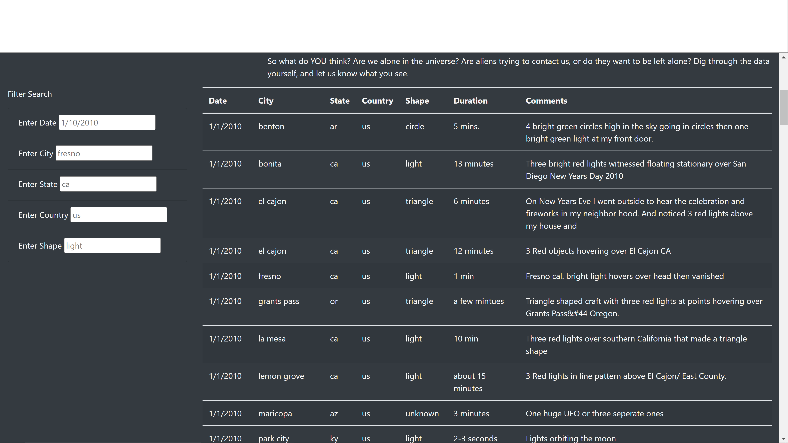
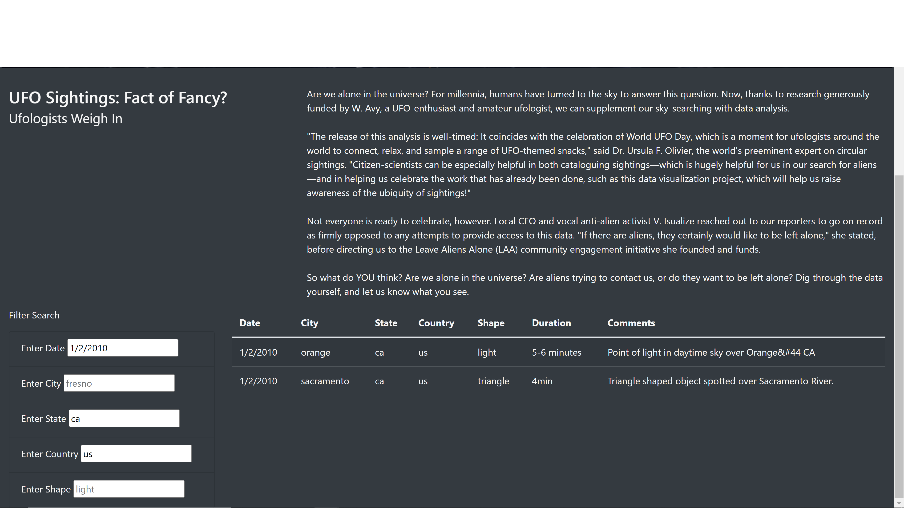

# UFOs

## Overview
### Purpose
The purpose of this project is to create a website that displays UFO sighting data, allowing for filtering based on date, city, state, country, and shape.

## Results
The UFO website functions by providing filter search ability for date, city, state, county, and shape. In order to filter the UFO sightings table, input the intended search variables, and the table will filter based on the input. Their is a placeholder in each input area to show proper format. 

## Summary
One drawback to this new design is that the input text boxes for the different filters are not aligned on the left, which looks messy. I would recommend that for further updates, this be corrected. Additionally, the photo background for the jumbotron is quite stretched, so finding an image that would not be stretched, would be a good thing to update.
